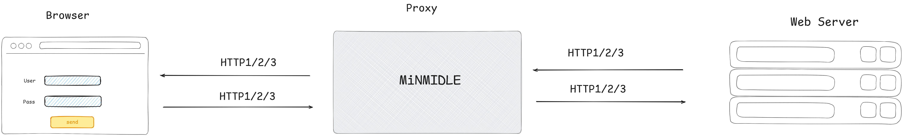

# MiNMIDLE

A lightweight intercepting proxy with a WPF GUI.  
Pause, inspect, edit, and replay HTTP/HTTPS requests manually.  
No scanner, no intruder, no spider. Just the proxy. Just the control.

## Idea 

## Features

- Intercept HTTP/HTTPS requests
- Edit headers and body in real time
- Manual request replay
- Native WPF graphical interface

## Technologies

- C# / .NET
- WPF-UI
- Titanium.Web.Proxy
